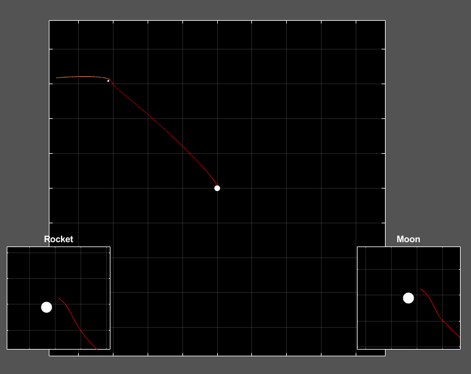

<pre>
----------------
MOONSHOT PLOTTER
----------------
by ANTIOCHIAN 2k18 // cDc

    Synopsis:
        MoonShow( velocity , launch angle , ...)

   Description:
        Simuluates a rocket launching with a given speed and velocity in the
        Earth/Moon system. Defaults to a successful launch if arguements
        are left blank.
    
    Optional Arguments (can be combined and concatenated):
        -M          start launch on moon instead of planet (light side)
        -T          execute simulation in Saturn/Titan system instead
        -L          significantly speeds up animation (can be choppy)
        -S          force autoscale for square view of system
        -Z          disable zoomboxes
        -O          keep viewport zoomed out entirely
        -G          adds a grid to all views
        -F          manually specify rocket starting location
        -P          manually specify starting moon 'phase'

Sample Input: MoonShot(0.0066,1.96,"-LGS")
</pre>
Sample Output:

